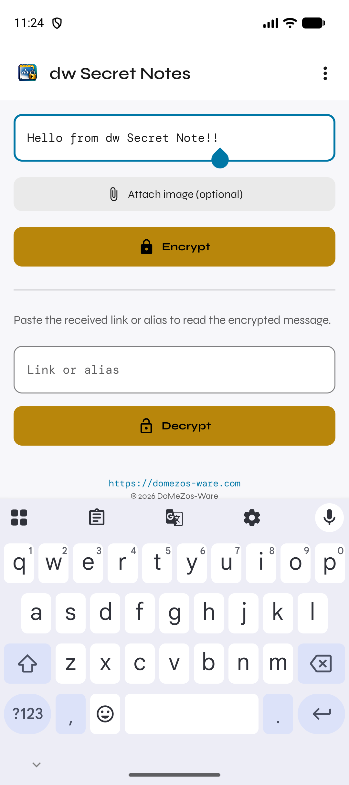
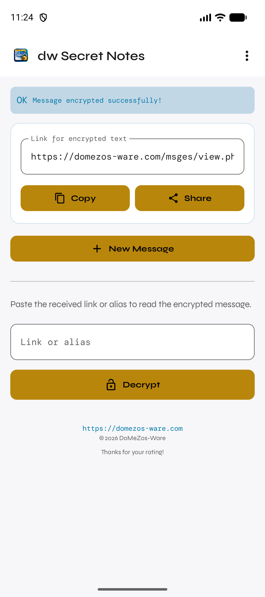
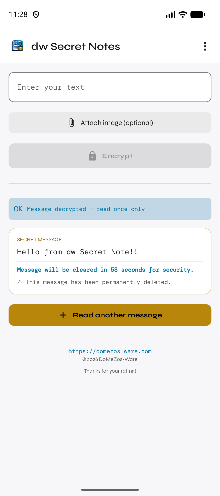
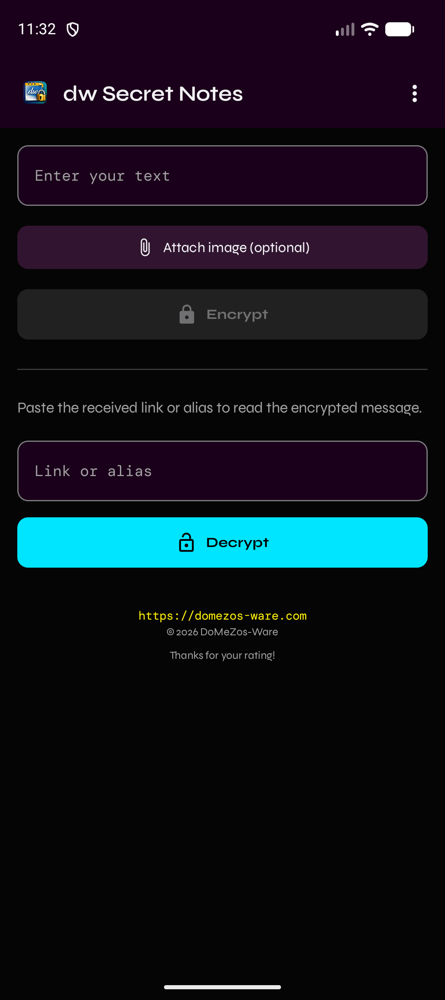
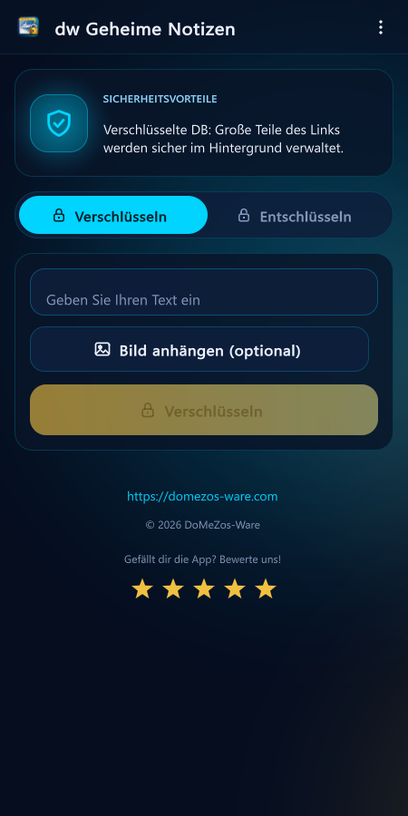
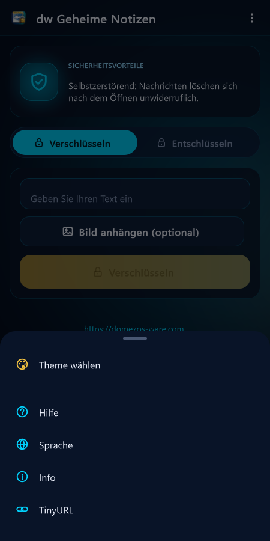
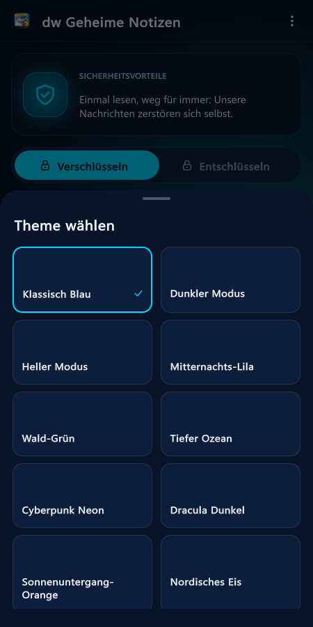
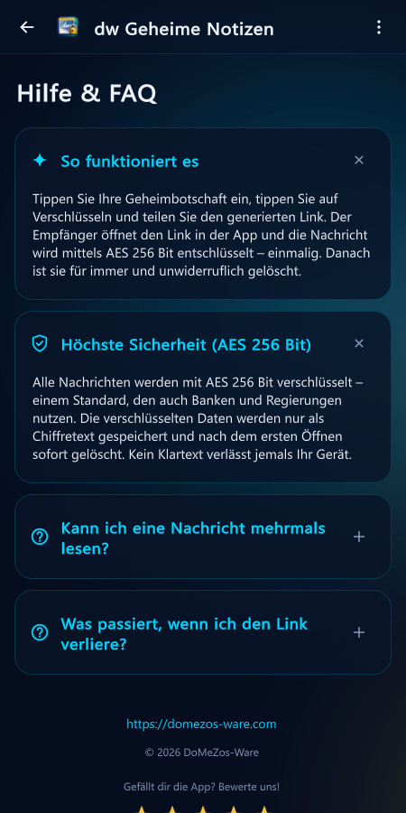
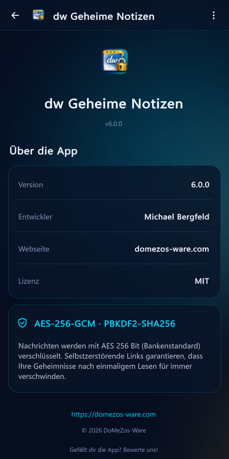
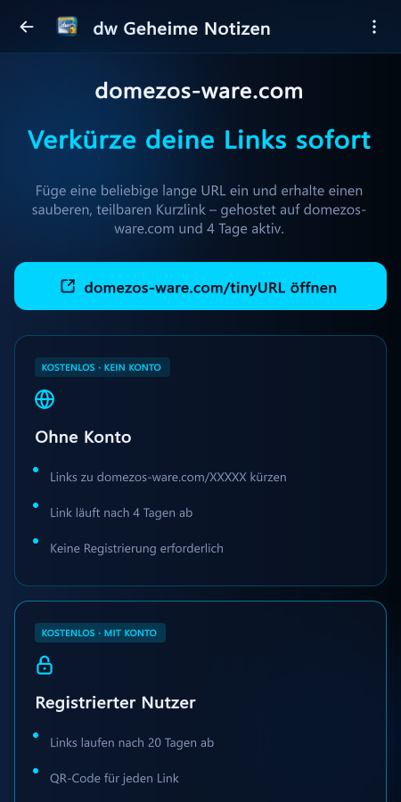

# dw Secret Notes

Ende-zu-Ende-verschlüsselte Nachrichten (Text oder Bild), die sich nach einmaligem Lesen selbst zerstören. Nachricht schreiben → Link teilen → Empfänger liest einmal → Server löscht sie unwiderruflich. Kein Account nötig.

---

## Screenshots

| Verschlüsseln | Link erzeugt | Entschlüsseln (60s-Countdown) | Dunkles Theme |
|---|---|---|---|
|  |  |  |  |

---

## Unity-Edition (v6.0.0) — neue Oberfläche

Die App wurde in **Unity 6 (UI Toolkit)** mit einer stark verbesserten Oberfläche neu aufgebaut. Funktionen und Backend sind gleich geblieben, Links sind also voll kompatibel mit der Kotlin-App und der WebApp. Quellcode: [`unity/`](unity/).

| Sprache (erster Start) | Verschlüsseln / Entschlüsseln | Menü | Themes |
|---|---|---|---|
|  |  |  |  |

| Hilfe & FAQ | Info | TinyURL |
|---|---|---|
|  |  |  |

- Animierter Aurora-Hintergrund, Glas-Karten, Tabs Verschlüsseln/Entschlüsseln, Vektor-Icons
- Countdown-Ring für die 60-Sekunden-Selbstzerstörung, Bild-Vollansicht, Einfügen aus der Zwischenablage
- Menü und Theme-Auswahl als Bottom-Sheets, aufklappbare FAQ, Hinweismeldungen
- Krypto nativ in C# (AES-256-GCM, PBKDF2-SHA256, 100 000 Iterationen), geprüft mit NIST-/RFC-Testvektoren und dem echten Backend
- Build-, Test- und Sync-Befehle: siehe [`unity/README.md`](unity/README.md)

---

## Beim ersten Start

**Sprachauswahl** (15 Sprachen) erscheint. Tippen und bestätigen. Später jederzeit über Menü → **Language** ändern.

---

## Hauptbildschirm

Zwei Bereiche: oben **Versenden**, unten **Lesen**.

### Nachricht versenden

- **Textfeld** — Geheimtext eingeben.
- **Bild anhängen** (optional) — Foto aus Galerie wählen. Vorschau erscheint, ✕ entfernt es.
- **Encrypt** — Verschlüsselt und lädt hoch. Nur verschlüsselter Inhalt verlässt das Gerät.
- Danach: **Copy** (Link kopieren) · **Share** (Teilen-Menü) · **New Message** (neu starten).

### Nachricht lesen

- **Link or alias** — empfangenen Link einfügen. Automatische Kurzlink-Erzeugung war an Premium gekoppelt und wurde entfernt — Encrypt liefert nur noch den langen `view.php`-Link. Wer einen kürzeren Link will, kürzt ihn manuell über die externe Seite [snote.fun/tinyURL.html](https://snote.fun/tinyURL.html) (Menüpunkt **TinyURL**).
- **Decrypt** — ruft Nachricht ab. Nicht gefunden → rote Meldung.
- Nach Entschlüsselung: Text/Bild mit **60-Sekunden-Countdown**. Server-Kopie ist bereits beim Öffnen gelöscht.
- **Read another message** — Ansicht leeren.

---

## Menü (⋮ oben rechts)

| Menüpunkt | Funktion |
|---|---|
| Choose Theme | 15 Farbdesigns, sofort aktiv |
| Language | Sprache wechseln |
| TinyURL | Infos zum domezos-ware.com-Linkverkürzer |
| Help | FAQ & Funktionsweise |
| Info | Version, Entwickler, Lizenz |

---

## Homescreen-Widgets

Langer Druck auf Homescreen → Widgets:
- **Schnell-Verschlüsseln** — Nachricht direkt vom Homescreen eingeben und Link erhalten.
- **Launcher** — App-Symbol zum direkten Öffnen.

---

## Sicherheit

- **AES-256-Verschlüsselung** — clientseitig, bevor die Nachricht das Gerät verlässt.
- Server speichert nur verschlüsselten Inhalt, niemals Klartext.
- Beim Öffnen wird die Nachricht **sofort und unwiderruflich gelöscht** — kein zweites Lesen, kein Backup.
- Kostenlos · kein Account · keine In-App-Käufe.

---

## Changelog

### v6.0.0 — 07.10.2026

- **Neue Unity-6-Edition** mit komplett neu gestalteter UI-Toolkit-Oberfläche (`unity/`), gleiches Paket `com.snote.domezos`, versionCode 47
- Gleiche Funktionen: Text + Bild verschlüsseln, Einmal-Links, 60-s-Selbstlöschung, Deep Links, Teilen-Intent, 15 Sprachen (inkl. RTL), 17 Themes, Homescreen-Widgets, In-App-Bewertung
- Krypto nativ in C# (AES-256-GCM / PBKDF2-SHA256), kompatibel zu Kotlin-App und WebApp
- Widget-Schnellverschlüsselung öffnet jetzt die App mit einem Schnell-Verschlüsseln-Sheet
- Info-Seite nennt jetzt korrekt **AES-256-GCM**
- Lokale Pfade auf `E:\AndroidStudioProjects\…` umgestellt

### v5.0.1 — 20.08.2026

- **Android App Links verifiziert** — Deep Links öffnen zuverlässig auf allen Android-Versionen (`.well-known/assetlinks.json`)
- **Service Worker** zur WebApp hinzugefügt
- **SEO:** `robots.txt`, `sitemap.xml`, Meta-Tags, Canonical-URLs, Open Graph, JSON-LD
- **Kurzlinks:** Auto-Erzeugung entfernt — Encrypt erzeugt immer den langen `view.php`-Link; manuelles Kürzen über [snote.fun/tinyURL.html](https://snote.fun/tinyURL.html)
- **TinyURL-Screen** Layout überarbeitet
- **Build:** `compileSdk 37`, `targetSdk 37`, Kotlin 2.2.10, AGP 9.3.1, Java 21

---

*Website: [domezos-ware.com](https://domezos-ware.com)*
