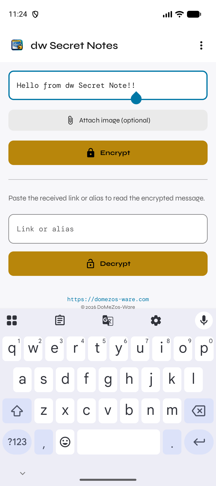
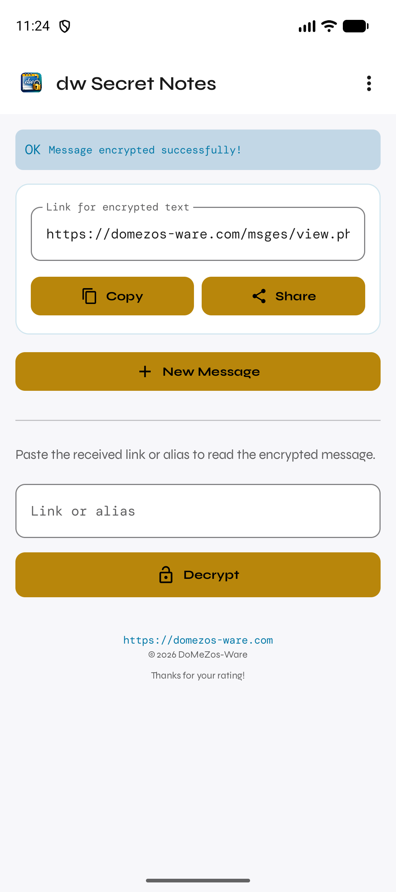
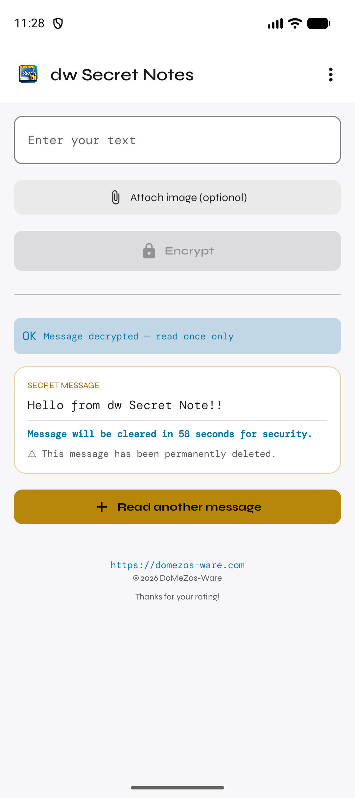
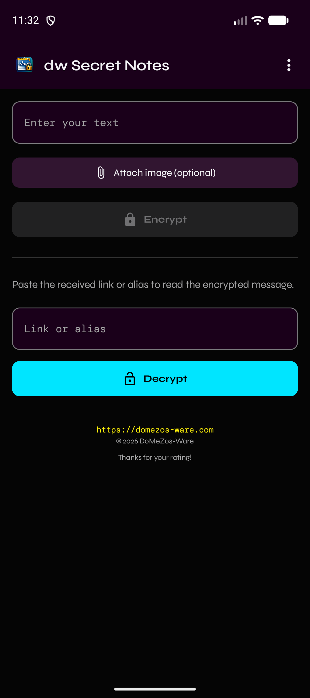

# dw Secret Notes

[](LICENSE)
[](https://play.google.com/store/apps/details?id=com.snote.domezos)
[](https://kotlinlang.org)
[](https://developer.android.com/jetpack/compose)
[](CONTRIBUTING.md)
[](https://github.com/domezos2024/dw-secret-notes/issues)
[](https://play.google.com/store/apps/details?id=com.snote.domezos)

**Encrypted self-destructing messages — read once, gone forever.**

Send text or images via a one-time link. The recipient reads the message once inside the app; it is then permanently deleted from the server. No account required.

---

## Screens & Usage

| Encrypt | Link generated | Decrypt (60s countdown) | Dark theme |
|---|---|---|---|
|  |  |  |  |

---

## Features

- AES-256-GCM encryption (client-side, PBKDF2 key derivation)
- Self-destructing links — read once, deleted immediately
- Text + image support
- 15 visual themes · 15 languages
- Deep-link handling — any matching link opens straight into decrypt

---

## How It Works

```
Sender                    Server                  Recipient
  │ 1. Write & Encrypt      │                        │
  │── AES-256-GCM ─────────▶│ Stores ciphertext+IV   │
  │◀── link / alias ────────│                        │
  │ 2. Share link ──────────────────────────────────▶│
  │                         │◀── Decrypt request ────│
  │                         │──── Plaintext ─────────▶│
  │                         │  Deletes immediately   │
```

Crypto runs **client-side** in a WebView (Web Crypto API / AES-256-GCM, PBKDF2 100k iterations). Server stores ciphertext + IV only — never plaintext or keys. Protocol: `WebApp/js/backend.js`.

---

## Usage

### Encrypt

1. Enter text and/or attach an image.
2. Tap **Encrypt** → link appears.
3. **Copy** or **Share** the link. Tap **New Message** to start over.

### Decrypt

1. Paste link into **Link or alias**.

   | Format | Example |
   |---|---|
   | Full URL | `https://domezos-ware.com/msges/view.php?com=17.08.2026_04-15-16-700&pass=211472091156881188247239491412542637191` |
   | Bare alias, no scheme | `17.08.2026_04-15-16-700` |
   | Password-protected, no scheme | `17.08.2026_04-15-16-700\|211472091156881188247239491412542637191` |

   Automatic shortlink generation was removed with Premium — Encrypt now always produces the long `view.php` link above (`domezos-ware.com?link=<alias>` redirect resolution may still work for old, pre-existing short links, but nothing generates new ones). Users who want a shorter link have to shorten it themselves at [snote.fun/tinyURL.html](https://snote.fun/tinyURL.html) (external, manual, see **TinyURL** in the menu).

2. Tap **Decrypt**. Message shows with a **60-second countdown**, then local view clears.
   Server copy is deleted on first successful decryption — a dropped connection loses the message permanently.

### Menu (⋮)

| Item | Action |
|---|---|
| Choose Theme | 15 color themes, applied instantly |
| Language | Reopen language picker (15 languages) |
| TinyURL | Info about the domezos-ware.com link shortener |
| Help | How it works + FAQ |
| Info | Version, developer, license |

### Widgets

Long-press home screen → Widgets:
- **Quick Encrypt** — type a message and get a share link without opening the app.
- **Launcher** — shortcut icon that opens the app.

---

## Deep Links

Registered patterns:
- `https://domezos-ware.com/msges/view.php?...`
- `https://domezos-ware.com?link=...`

Tapping a matching link anywhere on the device opens the app and auto-decrypts. Share-to-app (system share sheet → dw Secret Notes) also works. Password-protected links parse the `pass=` param automatically.

---

## Security

| Property | Detail |
|---|---|
| Algorithm | AES-256-GCM (client-side, Web Crypto API) |
| Key derivation | PBKDF2 — SHA-256, 100k iterations |
| Storage | Ciphertext + IV only — no plaintext stored |
| Deletion | Immediate & permanent on first decryption |
| Screenshot protection | `FLAG_SECURE` on Activity window |
| Transport | HTTPS only |
| API auth | `X-API-Key` header or `apikey` param |

**Limitations:** Recipient must use dw Secret Notes (no browser decryption). A dropped connection mid-decrypt loses the message permanently — no recovery possible.

---

## Languages

English · Deutsch · Español · 中文 (简体) · हिन्दी · العربية · Português · বাংলা · Русский · 日本語 · Français · اردو · Indonesia · 한국어 · Italiano

---

## Technical Overview

| Component | Technology |
|---|---|
| Language | Kotlin 2.2 |
| UI | Jetpack Compose + Material 3 |
| Encryption bridge | WebView JS interface → Web Crypto API |
| Persistence | SharedPreferences |
| Deep links | Android Intent filters + URI parsing |
| Security | `FLAG_SECURE` on Activity window |

**Project structure:**

```
app/src/main/java/com/snote/domezos/
├── MainActivity.kt              Entry point, deep link handling
├── DwApplication.kt
├── data/
│   ├── Backend.kt               Backend host + API key (single source of truth)
│   ├── ImageUtils.kt            Bitmap/base64 helpers
│   ├── LocaleManager.kt
│   └── Prefs.kt                 SharedPreferences wrapper
├── navigation/
│   ├── AppNavigation.kt
│   └── Screen.kt
├── widget/
│   ├── SecretWidgetProvider.kt  Quick-capture widget
│   ├── LauncherWidgetProvider.kt
│   ├── WidgetEncryptActivity.kt
│   └── WidgetRefresher.kt
└── ui/
    ├── components/
    │   ├── AppTopBar.kt
    │   └── SecretWebView.kt     Encrypt/decrypt WebView bridge
    ├── screens/
    │   ├── MainScreen.kt
    │   ├── TinyUrlScreen.kt
    │   ├── LanguageScreen.kt
    │   ├── HelpScreen.kt
    │   └── InfoScreen.kt
    └── theme/
        ├── AppThemes.kt         15 theme configurations
        ├── Color.kt
        ├── Theme.kt
        └── Type.kt
```

---

## Build

```bash
./gradlew assembleDebug
./gradlew assembleRelease
./gradlew lint
./gradlew testDebugUnitTest
```

Config: `compileSdk 37`, `minSdk 26`, `targetSdk 37`, Kotlin 2.2.10, AGP 9.3.1, Java 21. No product flavors. No instrumentation tests — verify UI/WebView changes by running on device.

---

## Public Backend API

`WebApp/api/` is open to third-party clients:
- **Auth:** `X-API-Key: <key>` header (preferred) or `apikey=<key>` param.
- **Tiers:** `free` (self-serve, open an issue/PR) · `trusted` / `internal` (higher limits, paid — contact michaelbergfeld1982@gmail.com).
- Rate limits: `WebApp/api/auth.php` · Key format: `WebApp/api/data/keys.example.php`.
- Endpoints + crypto protocol: [`WebApp/README.md`](WebApp/README.md).

---

## Support

Free, open-source, ad-free — but server costs are real. Tips welcome:
**[paypal.me/domezos1982](https://paypal.me/domezos1982)**

---

## License

MIT — see [LICENSE](LICENSE). Covers the Android app and `WebApp/`.

*© 2026 domezos-ware.com — Michael Bergfeld*
